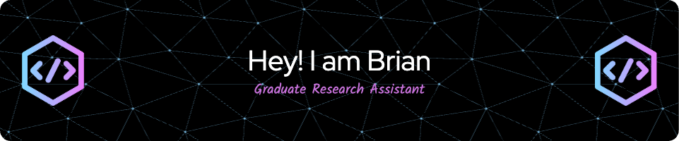

<!--
**bllin001/bllin001** is a ✨ _special_ ✨ repository because its `README.md` (this file) appears on your GitHub profile.

Here are some ideas to get you started:

- 🔭 I’m currently working on ...
- 🌱 I’m currently learning ...
- 👯 I’m looking to collaborate on ...
- 🤔 I’m looking for help with ...
- 💬 Ask me about ...
- 📫 How to reach me: ...
- 😄 Pronouns: ...
- ⚡ Fun fact: ...
-->

#  Welcome to Brian's Github
---------------------------

      

---------------------------

## About me 😀
Ph.D. student in Computer Science currently studying at Old Dominion University in Norfolk, United States. As a Graduate Research Assistant, I have expertise in data processing, visualization, machine learning, deep learning, and natural language processing. I have gained a broad range of research experience across different topics, from finance and port logistics to forced migration and text accessibility for visually impaired university students. During my academic career, I have collaborated with universities in Colombia and the United States to develop computational insights about frustration toward migrants in global refugee host communities. I am proficient in multiple programming languages, including R, Python, SQL, and Power BI.

* 🌍  I'm based in Norfolk, VA, USA 🇺🇸
* 🖥️  See my portfolio at [https://bllin001.github.io/](http://bllin001.github.io/)
* ✉️  You can contact me at [bllin001@odu.edu](mailto:bllin001@odu.edu)
* 🚀  I'm currently working on [Virginia Modeling, Analysis, and Simulation Center](http://vmasc.org/)
* 🧠  I'm learning Retrieval-Augmented Generation , Knowledge Graph
* 🤝  I'm open to collaborating on Machine Learning and Natural Language Processing
* ⚡  I am from Barranquilla, Colombia 🇨🇴, but I was born in Mainz, Germany 🇩🇪

## Skills 🎯
                     

## Badges

<b>GitHub Stats 📊</b>

<table style="border: none; width: 100%;">
  <tr>
    <td valign="top" style="border: none; width: 55%;"></td>
    <td rowspan="2" valign="top" style="border: none; width: 55%;"></td>
  </tr>
  <tr>
    <td valign="top" style="border: none; width: 55%;"></td>
  </tr>
</table>

<b>Top Repositories 🔥</b>

  
  

     

  
  

     

<b>GitHub Trophies 🏆</b>

